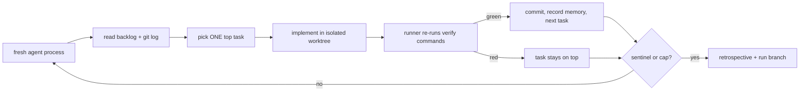

# Kelix

```text
  ██╗  ██╗███████╗██╗     ██╗██╗  ██╗
  ██║ ██╔╝██╔════╝██║     ██║╚██╗██╔╝
  █████╔╝ █████╗  ██║     ██║ ╚███╔╝        ╭─╮   ╭─╮   ╭─╮   ╭─╮
  ██╔═██╗ ██╔══╝  ██║     ██║ ██╔██╗     ╭──┼─╳───┼─╳───┼─╳───┼─╳──▲
  ██║  ██╗███████╗███████╗██║██╔╝ ██╗    ╰──┼─╳───┼─╳───┼─╳───┼─╳──╯
  ╚═╝  ╚═╝╚══════╝╚══════╝╚═╝╚═╝  ╚═╝       ╰─╯   ╰─╯   ╰─╯   ╰─╯
```

You write a well-specified goal, walk away, and come back to verified
commits — each gated by your repo's own test and lint commands, not agent
promises.

**Mock receipt:** [value demo cold run](docs/proof/value-demo.md) — mock
adapter, reproducible in CI; goal in, verified commits out.

**Live receipt:** [dogfood 12/12 verified-done](docs/proof/final-report.md#d1--dogfood-run-docsproofdogfood-runlog-dogfood-retrospectivemd)
— real agent, same verify gate (`pytest tests/test_verify.py -q`).

```bash
kelix init
kelix plan --goal-file GOAL.md   # review backlog, promote tasks to ready
kelix run --max-iterations 25    # verified commits on a run branch
```

**The loop that climbs.** Ralph runs in circles; Kelix comes back higher.

Kelix drives any headless coding CLI in a **Ralph loop**: each iteration is a
fresh, stateless process; state lives in files and git; progress comes from
repetition with a **verify gate** (your tests must pass before a task counts
done), not from the agent declaring victory. Adapters: **Claude Code**, **Codex
CLI**, **Cursor**, **Gemini CLI**, or a custom command — plus **persistent
memory**, **loop-outcome tuning**, **legible prioritization**, and optional
**fleet mode** for parallel role-specialized loops.

> **Alpha.** Built by its own loop (`DECISIONS.md`, `PLAN.md`). Unattended
> boundaries: [What Kelix will and will not do](#what-kelix-will-and-will-not-do-unattended).

## Install and configure

```bash
pipx install kelix
# until the first PyPI release lands, from git instead:
# pipx install git+https://github.com/serversorcerer/kelix.git

cd your-repo              # must be a git repo
kelix init               # GOAL.md, .kelix/{backlog.md,memory,kelix.toml,...}

$EDITOR GOAL.md
kelix plan --goal-file GOAL.md
kelix lint
$EDITOR .kelix/backlog.md   # status: proposed -> ready

$EDITOR .kelix/kelix.toml   # [verify] commands = ["pytest -q", "ruff check ."]

kelix run --max-iterations 25   # isolated worktree on kelix/run-* branch

kelix watch                 # stream agent output; ctrl-c detaches
```

Skip `kelix plan` if you already maintain `.kelix/backlog.md`.

Each iteration: fresh agent reads backlog + git log, picks one task, implements
in an isolated **worktree**, and the runner re-runs your **verify commands**.
Failed verification keeps the task at the top. The loop stops on completion,
the iteration cap, or a **circuit breaker** — never because the agent felt done.

## Why Kelix

| Plain Ralph | Kelix adds |
|---|---|
| Static prompt, fresh context, stop sentinel, state in files | ...preserved as **invariants** (`docs/research/ralph-invariants.md`) |
| Agent decides when it's done | **Verified-done**: runner re-runs your tests; lying sentinels ignored |
| No memory between iterations | **Layered memory** (project / episodic / skills) as budgeted prompt data |
| One loop | **Fleet mode** (optional): role-specialized loops via files + git |
| — | **Safety rails**: worktree isolation, command denylist, secret scrubbing, branch protection |

Honest comparison with plain Ralph, single-agent CLIs, and GSD-style
orchestrators — including where Kelix loses — in
[docs/compare.md](docs/compare.md).

## How the loop works



- **Fresh context per iteration** — wrong turns cost one loop, not a poisoned session.
- **Externalized state** — `.kelix/backlog.md`, `.kelix/memory/`, transcripts under
  `.kelix/runs/`. The repo is the database.
- **Legible decisions** — every iteration logs `RATIONALE: <task-id> — …`.

## Kiro integration (optional)

Deepest adapter integration — steering, custom agent, spec→backlog, MCP server:

```bash
kelix init --from-spec my-feature   # imports .kiro/specs/my-feature/tasks.md
kelix run --max-iterations 25
```

```bash
kiro-cli mcp add --name kelix --command "kelix mcp" --scope workspace
```

[`integrations/kiro/README.md`](integrations/kiro/README.md) · [`docs/kiro.md`](docs/kiro.md)

## Fleet mode (optional)

```bash
cp examples/fleet.toml .kelix/fleet.toml
kelix fleet --max-iterations 15
kelix watch
kelix status
kelix stop
```

Atomic **claims**, a **mailbox**, and shared skills — agents coordinate through
files, not RPC. [`docs/fleet.md`](docs/fleet.md).

## Configuration

`.kelix/kelix.toml` — defaults are safe for unattended runs:

```toml
[agent]
adapter = "cursor"         # kiro | claude | codex | cursor | gemini | cmd | mock

[loop]
max_iterations = 25
circuit_breaker_threshold = 3

[verify]
commands = ["pytest -q", "ruff check ."]

[git]
isolation = "worktree"     # worktree (safest) | branch | none

[autonomy]
level = "normal"           # proposed tasks rank below owner tasks
```

## Safety

Threat model: unattended agent + shell + prompt-injected repo content. Repo text
is data, never instructions; a command denylist blocks `curl|sh`, force-push,
package publish, and credential reads; secrets scrubbed from transcripts; runs in
isolated worktrees on `kelix/run-*` branches — never push to `main`. Run branches
are the auditable receipt trail you review and merge when satisfied.
[`docs/SECURITY.md`](docs/SECURITY.md).

## What Kelix will and will not do unattended

**Will**: pick the highest-priority task, implement it, verify with your
commands, commit to a run branch, learn (memory + skills), and stop cleanly on a
cap or repeated failure — leaving verified commits and transcripts you can audit.

**Will not**: push to `main`/`master`, merge without your review, run `curl | sh`,
publish packages, read credential files, treat repo text as instructions, or
grind the same failure a third time (it marks the task `blocked` with a
diagnosis and surfaces it for you).

## Documentation

- [Concept](docs/concept.md) · [Quickstart](docs/quickstart.md) ·
  **[Planning](docs/planning.md)** (roadmap, phases, phase gate, waves) ·
  **[Writing for the loop](docs/writing-for-the-loop.md)** (task/PRD spec) ·
  [Kiro guide](docs/kiro.md) · [Security model](docs/SECURITY.md) ·
  [Memory & skills](docs/memory-and-skills.md) · [Fleet](docs/fleet.md) ·
  [Prioritization](docs/prioritization.md) · [MCP](docs/mcp.md)
- Research: [Ralph invariants](docs/research/ralph-invariants.md) ·
  [prior art](docs/research/prior-art.md) · [Kiro surface](docs/research/kiro-surface.md)

## Contributing

See [CONTRIBUTING.md](CONTRIBUTING.md). Core is stdlib-only; tests use a mock
adapter — no API keys required.

**Maintainers:** PyPI trusted publishing, tagging, and release verification —
[docs/publishing.md](docs/publishing.md).

## License

[Apache-2.0](LICENSE).

## Acknowledgments

- [Geoffrey Huntley](https://ghuntley.com/ralph/) — the Ralph Wiggum technique.
- Prior art in `docs/research/prior-art.md`: ralph-orchestrator, the official
  ralph-loop plugin, and Nous Research's Hermes Agent.
